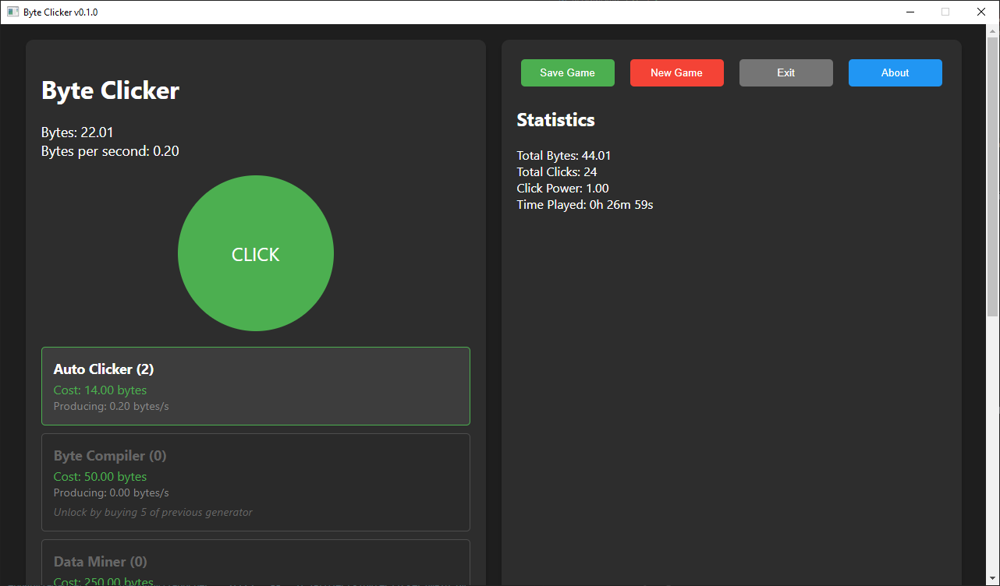

# Byte Clicker

A modern incremental clicker game that demonstrates how to build interactive desktop applications using Python and JavaScript. This project serves as a practical example of combining PyQt6's native capabilities with web technologies to create rich, responsive applications.

The game showcases:
- Python backend for system operations and data persistence
- JavaScript frontend for dynamic UI and game logic
- Bidirectional communication between Python and JavaScript
- Modern web technologies in a desktop environment
- Real-time updates and state management

Click to generate bytes and unlock various generators to automate your byte production!



## Architecture Overview

This project demonstrates several key concepts for hybrid Python-JavaScript applications:

1. **Frontend-Backend Separation**
   - JavaScript handles UI updates and game logic
   - Python manages system operations and data persistence
   - Clean separation of concerns for maintainability

2. **Bridge Communication**
   - Bidirectional Python-JavaScript communication via QWebChannel
   - Asynchronous operations with promises
   - Type-safe method calls between languages

3. **Modern Development Practices**
   - Event-driven architecture
   - Real-time state management
   - Responsive UI design
   - Error handling across language boundaries

## Features

- Interactive clicking mechanism
- Multiple generators with increasing production rates
- Auto-save functionality
- Performance metrics and statistics
- Modern, responsive UI
- Progress-based generator unlocking system

## Requirements

- Python 3.8 or higher
- PyQt6
- PyQtWebEngine

## Installation

1. Clone this repository:
```bash
git clone https://github.com/non-npc/Byte-Clicker-Incremental-Game.git
cd Byte-Clicker-Incremental-Game
```

2. Create a virtual environment (recommended):
```bash
python -m venv venv
# On Windows:
venv\Scripts\activate
# On macOS/Linux:
source venv/bin/activate
```

3. Install dependencies:
```bash
pip install -r requirements.txt
```

## Running the Game

To start the game, run:
```bash
python main.py
```

## How to Play

1. Click the green circle to generate bytes
2. Purchase generators to automate byte production
3. Unlock new generators by purchasing 5 of the previous generator
4. Save your progress using the "Save Game" button
5. Start fresh with the "New Game" button

## Game Elements

### Generators

1. **Auto Clicker** - Basic automation
2. **Byte Compiler** - Improved byte generation
3. **Data Miner** - Efficient byte production
4. **Quantum Computer** - Advanced computation
5. **AI Cluster** - Massive parallel processing
6. **Quantum Network** - Network-enhanced production
7. **Digital Dimension** - Ultimate byte generation

### Features

- Auto-save every minute
- Real-time statistics tracking
- Performance metrics
- Progression system
- Modern UI with visual feedback

## Save System

The game includes both automatic and manual save features to ensure your progress is never lost:

### Auto-Save
- Automatically saves your game progress every 60 seconds
- Saves are stored in `clicker_save.json` in the game directory
- Auto-save runs silently in the background without interrupting gameplay

### Manual Save
- Click the "Save Game" button at any time to manually save your progress
- Visual feedback confirms successful saves with a temporary "Saved!" message
- Recommended to manually save before exiting the game

### Save File
- Save data is stored in JSON format
- Includes all game state:
  - Current and total bytes
  - Generator counts and states
  - Game statistics
  - Timestamps
- Location: `clicker_save.json` in the game directory

## Development

The game is built using:
- PyQt6 for the application framework
- JavaScript for game logic
- HTML/CSS for the user interface
- QWebChannel for Python-JavaScript communication

## Bridge Interface

The game uses a Python-JavaScript bridge (via QWebChannel) to enable communication between the UI layer and the system layer:

### Available Bridge Methods

#### Game State Management
- `save_game(game_state: str) -> str`
  - Saves the current game state to `clicker_save.json`
  - Parameter: JSON string containing complete game state
  - Returns: Success/error message
  
- `load_game() -> str`
  - Loads game state from `clicker_save.json`
  - Returns: JSON string of saved game state or empty object if no save exists
  
#### System Functions
- `show_about()`
  - Displays the About dialog with game version and information
  - Shows native system dialog with game details
  
- `exit_app()`
  - Handles application exit with confirmation
  - Shows confirmation dialog before quitting
  - Prompts user to save if needed

### Using the Bridge in JavaScript

```javascript
// Initialize bridge connection
new QWebChannel(qt.webChannelTransport, function(channel) {
    window.bridge = channel.objects.bridge;
    // Bridge is ready to use
});

// Example: Save game
bridge.save_game(JSON.stringify(game_state))
    .then(response => {
        console.log(response); // "Game saved successfully"
    });

// Example: Load game
bridge.load_game().then(saved_state => {
    const game_state = JSON.parse(saved_state);
    // Process loaded state
});

// Example: Show about dialog
bridge.show_about();

// Example: Exit application
bridge.exit_app();
```

### Implementation Details

- Bridge class: `WebBridge` in `main.py`
- Communication protocol: QWebChannel
- Data format: JSON for state transfer
- Error handling: Try-catch blocks with error messages
- Thread safety: All methods are synchronous and thread-safe

## License

CC0 License - Feel free to modify and distribute this code as you like! 